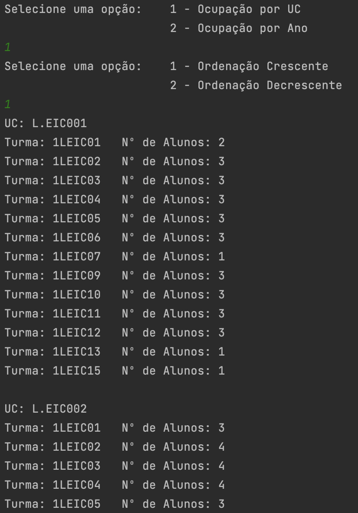

# Algorithms and Data Structures
Development of a system capable of assisting in the management of student schedules after their creation.

## Implemented Features

### Main Menu

### View Student Schedule

### Class Occupancy

### View Students in the Class

### Students with More Than N Number of Courses

### List of Students in Alphabetical Order

### Class Schedule

